***This 'Student Record System' using JDBC is created by Ankita Sikder and Biswarup Bhattacharjee, students of BTECH, in University of Engineering and Management, Kolkata.***

**Email Id: ankita.sikder14@gmail.com.** 

**Contact No: 8583939774.** 

<p align="left">
<a href="https://facebook.com/ankita.sikder.104" target="blank"></a>
<a href="https://instagram.com/ankita.sikder14" target="blank"></a>
<a href="https://github.com/biswa2210/ankitasikder" target="blank"></a>
</p>

# JDBC-STUDENT-RECORD-SYSTEM :boy: :girl: 
 
[](https://shields.io/) [](https://shields.io/) [](https://shields.io/) [](https://shields.io/) [](https://shields.io/)

## About :point_down:

<div align="justified">
     
Here in java environment, we can add, delete, fetch records. Here in SQL environment, we can also see records as table. We can fetch data very efficiently using this concept for deployment of this project. A student information system (SIS), student management system, school administration software or student administration system is a management information system for education establishments used to manage student data. Student information systems provide capabilities for registering students in courses; documenting grading, transcripts of academic achievement and co-curricular activities, and the results of student assessment scores; forming student schedules; tracking student attendance; and managing other student-related data needs in an educational institution. User has to run the project after opening it in eclipse or idea intellij. Then he has to see the menu. Accordingly he can choose options for specific tasks like adding records, deleting, searching or view records. These types of tasks can be done easily. Wrong credentials will note be taken. If same type of record for some specific cases is given then the program will not work for that. After using user can exit the program. From SQL environment also database can be accessed. This program is made with just real world idea. It is simple and efficient. This computerized system store all the data in the database which makes it easy to fetch and update whenever needed. We have come with this project with JDBC. We have made a connection to a database, created SQL statements, executed SQL queries in the database, viewed and modified the resulting records. JDBC stands for Java Database Connectivity. JDBC is a Java API to connect and execute the query with the database. It is a part of JavaSE (Java Standard Edition). JDBC API uses JDBC drivers to connect with the database. Before JDBC, ODBC API was the database API to connect and execute the query with the database. But, ODBC API uses ODBC driver which is written in C language (i.e. platform dependent and unsecured). That is why Java has defined its own API (JDBC API) that uses JDBC drivers (written in Java language).
</div>

## Applications :point_down:

1. Improves the General Performance Of Students
For students to come out with good grades, the focus is highly needed. With this school administration software, students are able to use their precious time for relevant things which is studying rather than keep track of their records to make sure things are intact. Moreover, fear of losing important records to manual management is completely off the line with the help of this software.
2. It helps Simply and Streamlines All Task
As a teacher, keeping track of all the activities done by each student is never easy and inefficient. But with this student record system, teachers are able to keep track of each student work and what is yet to be done. In most software, there is a dashboard and a single screen display to make things even easier and more efficient.
3. Improved Communication
It's impossible for every student in a class to get each lesson passed across while teaching. This might be a problem on the path of the students being timid or reluctant at that point in time or insufficient time to ask questions. With the help of this software, that has been sorted out. Most online school management software now has an inbuilt discussion panel where students could easily communicate with their teachers and ask relevant questions.
4. Can Be Accessed by All Parties Involved
Gone are the days when parents know little to nothing about what their child or ward does at school. This open source school management system has made it possible for parents to have access to their children's school activities, assignments, attendance, and other relevant information just by using the software.
5. Efficient Management And Organization of Timetables
The management of a school timetable is the work of the admin department of a school. Despite being dedicated to a department, it never correlates. With this software, the reverse is the case. This student record system is able to organize school timetables in such a way that they won't be a clash of lectures. In addition to that, students, teachers, and parents have access to it.

## Future Scopes :point_down:

1.This student record system can be deployed in a online web portal for students and teachers.
2. One can upgrade this web portal to store subject video lectures under different professor names and also maintain the previous year’s question papers in it.
3.The portal can be used to take day to day attendance and automatically send an SMS to the students and their parent.
4. One can deploy this web application into mobile android application and be used in smaller devices like mobile phones, tablets and notepads.
5. In future web portal can be combined with the university internal and external web sites. So that all courses in the university will have single web app.

## Folder Structure :point_down:

```bash
JDBC-STUDENT-RECORD-SYSTEM
     ├── .settings
     ├── bin
     ├── src
     |     ├── com/student/manage
     |     |         ├── ConnectionMethods.class
     |     |         ├── ConnectionMethods.java
     |     |         ├── ConnectionProvider.java
     |     |         ├── ConnectionProvider.class
     |     |         ├── Student.java
     |     |         └── Student.class
     |     ├── start.class
     |     ├── start.java
     |     └── menu.class 
     └── .project
```                       

## FUNCTIONAL REQUIREMENTS :point_down:

Requirement analysis is a software engineering technique that is composed of the various tasks that determine the needs or conditions that are to be met for a new or altered product, taking into consideration the possible conflicting requirements of the various users.
Functional requirements are those requirements that are used to illustrate the internal working nature of the system, the description of the system, and explanation of each subsystem. It consists of what task the system should perform the process involved, which data should the system holds and the interfaces with the user. The functional requirement identified are:<br>
a.	Adding Students:<br>
All the required students’ details containing their name, roll number, enrolment number, registration number, phone number, city are added when we choose option 1 in menu.
b.	Displaying Whole Record:<br>
All the added records are stored in a database and are fetched and showed when we choose option 3 in menu.
c.	Searching Particular Student Information:<br>
We can choose option 4 when we want to search a particular student’s record. We have to give the enrolment number of that student to get that student’s details.
d.	Deleting Records:<br>
When we want to delete a student’s record we have to choose option 2 and give that student’s id no. Then that record will be deleted.
e.	Exit Program:<br>
If we want to exit the program we have to choose option 5. Then the program will be closed.
We have used Idea Intellij Software for java and MySql for sql.
JDBC Connectivity:<br>
We have created a project in Idea Intellij IDE. We have created 4 java files in src folder. These are Main.java, ConnectionProvider.java, ConnectionMethods.java, Student.java. 
We have successfully established a connection with the relation database model with ‘ConnectionProvider.java’ and created a new database called “students_record” using mysql .With the specified root route and in the specified location (here localhost ) with particular username and password we have established a smooth connection with our java project. Handling records and searching for them becomes easier which such database management system.
 We used a table “students” in our database and created an array “enrolls[]” in order to check if multiple records of same enrolment number  of student are being entered the entry is being declined showing that the above enrolment number has been entered previously. 
We created an array “rgnos[]” in order to check if multiple records of same registration number of student are being entered the entry is being declined showing that the above registration number has been entered previously.
Such error handling, easy searching and safer security of storing data is only being established with the help of this Java Database Connectivity.
A JAR is a package file format was included in order to provide the connectivity of our database , typically used to aggregate many Java class files and associated metadata and resources into one file for distribution. JAR files are archive files that include a Java-specific manifest file. They are built on the ZIP format and typically have a .jar file extension.

## Screenshots of this part :point_down: 

<div align="center">
 
<a href="pics/sql1.PNG">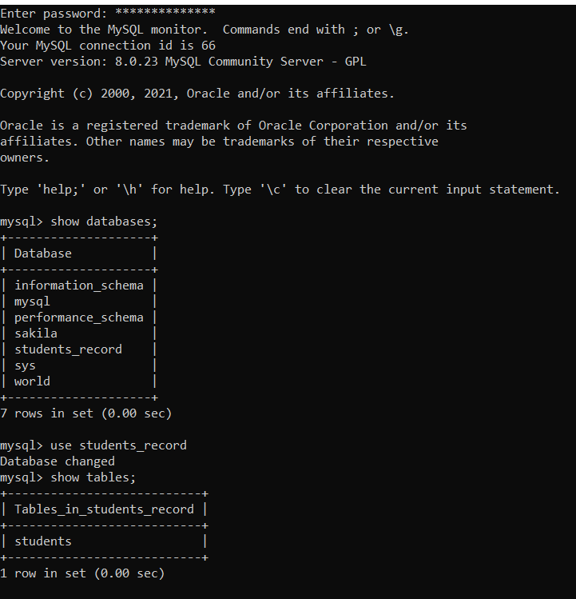</a> <a href="pics/sql2.PNG">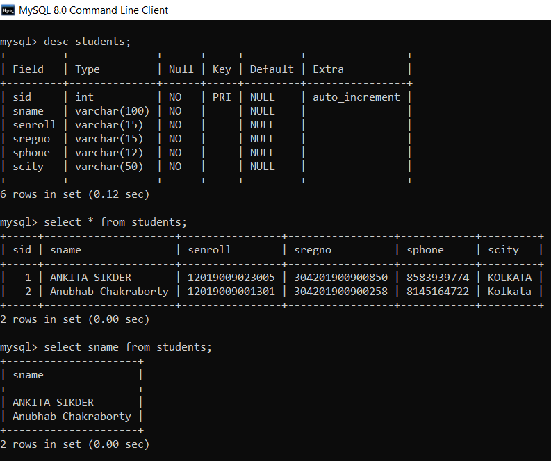</a>
 
<a href="pics/jdbc1.PNG">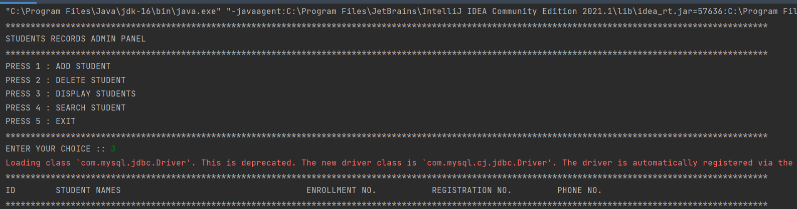</a> 
     
<a href="pics/jdbc2.PNG">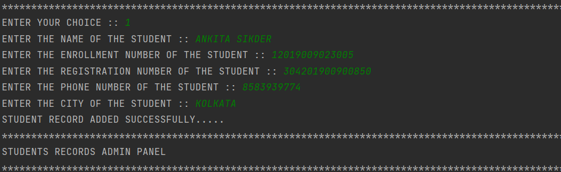</a>

<a href="pics/jdbc3.PNG">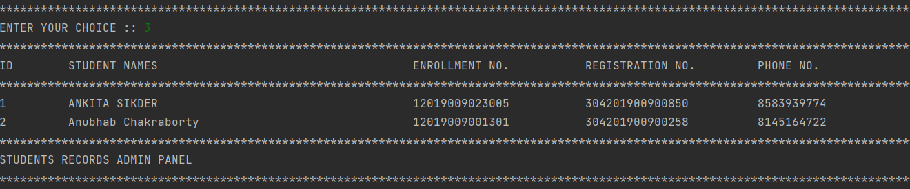</a> 

<a href="pics/jdbc4.PNG">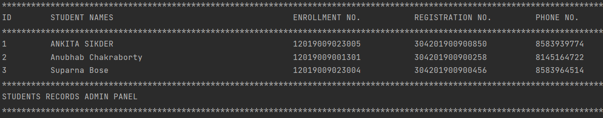</a>

<a href="pics/jdbc5.PNG">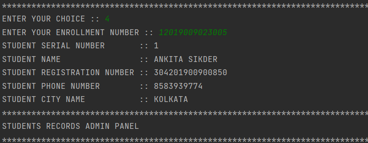</a> 

<a href="pics/jdbc6.PNG">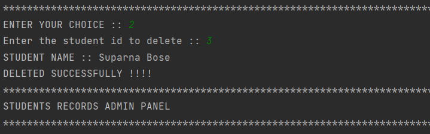</a>

<a href="pics/jdbc7.PNG">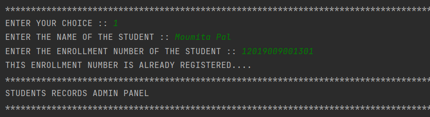</a> 

<a href="pics/jdbc8.PNG">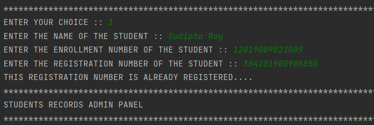</a>

<a href="pics/jdbc9.PNG">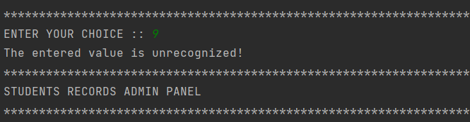</a> 

<a href="pics/jdbc10.PNG">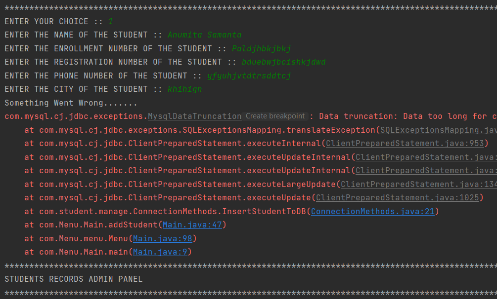</a>


</div>


